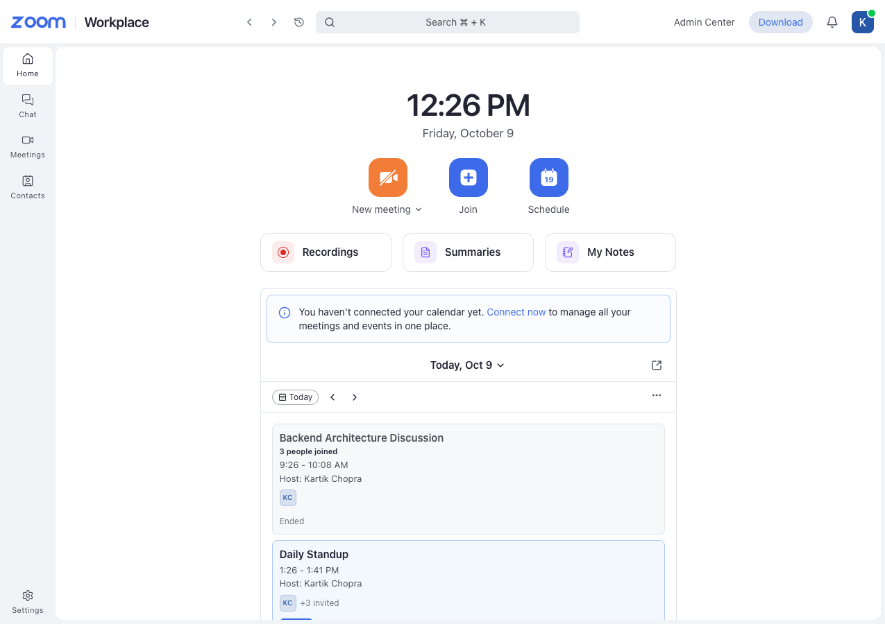
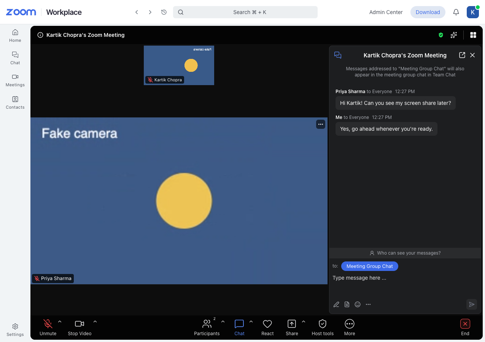
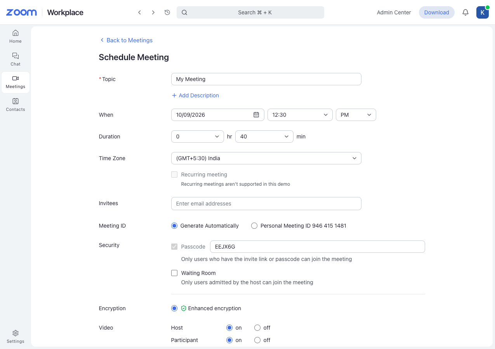
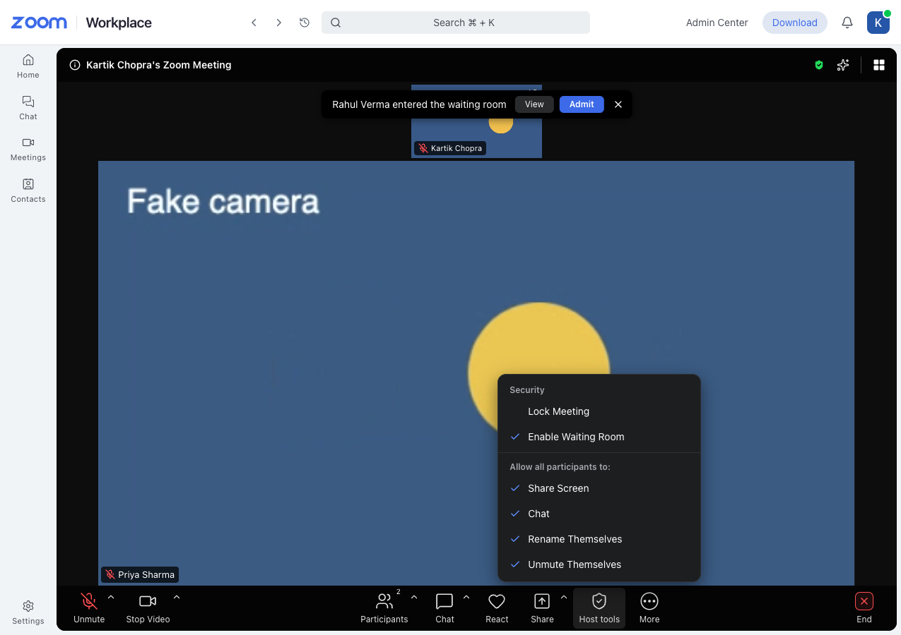
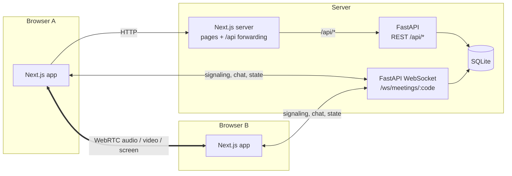
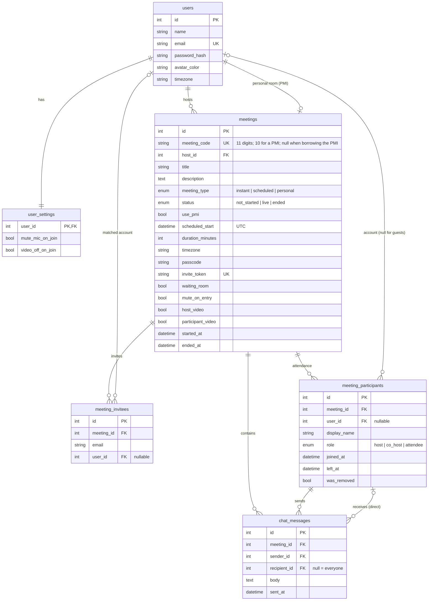

# Zoom Clone — Zoom Workplace web client

A working clone of the **Zoom Workplace web client**: schedule and manage meetings, then
meet with real video, audio, screen sharing, chat and host controls, all running in the browser.

**Live app:** https://zoom-gamma-lemon.vercel.app (demo login `kartikChopra@demo.dev` / `password123`)

To try a call, start a **New meeting**, copy the invite link from **ⓘ**, and open it in an incognito window or on another device.

- **Frontend:** Next.js 15 (App Router, TypeScript, Tailwind CSS)
- **Backend:** FastAPI + SQLAlchemy 2 + Alembic
- **Database:** SQLite
- **Realtime:** FastAPI WebSockets for signaling + browser-to-browser WebRTC for media

| Home | Meeting room (two people) |
|---|---|
|  |  |
| **Schedule Meeting** | **Host controls & waiting room** |
|  |  |

<sub>Screenshots come from the automated tests, which use a synthetic "Fake camera" because headless browsers have no webcam.</sub>

---

## Features

### Core (assignment requirements)

| Requirement | Where |
|---|---|
| **Landing dashboard** with navbar, profile/settings, New Meeting / Join / Schedule, upcoming and recent meetings | Home (`/`): live clock, the three action tiles, a day calendar with date navigation, an "Upcoming meetings" list and a "Recent meetings" list |
| **Instant meeting:** unique ID, shareable invite link, redirect to the room | **New meeting** → 11-digit ID, passcode and `/j/<id>?pwd=<token>` link → `/wc/<id>`. The ▾ menu can start your Personal Meeting ID instead |
| **Join meeting** by ID or invite link, display name first, meeting must exist | **Join** dialog (ID or pasted link + name, passcode step when needed), invite landing page `/j/<id>`, browser join page `/wc/<id>/join` |
| **Schedule meetings:** title/description, date-time picker, duration, auto link, stored, shown in Upcoming | Zoom's Schedule Meeting form: topic, description, date, time, AM/PM, duration, time zone, invitees, generated ID or PMI, passcode, waiting room, video defaults |

### Bonus features

- **Responsive:** phone, tablet and desktop. On phones the left rail becomes a bottom tab bar, the meeting goes full screen and the toolbar collapses into **More**.
- **Login / sign-up:** Sign In, Sign Up and Sign Out. The seeded default user is signed in automatically, as the brief asks.
- **Host controls:**
  - **Muting:** mute one person, Mute All (optionally blocking self-unmute), Ask to Unmute.
  - **Removing:** remove a participant; they can't rejoin.
  - **Roles:** make or withdraw co-host, hand over host.
  - **Meeting access:** waiting room (admit / remove / admit all) and lock meeting.
  - **Permissions:** allow participants to share, chat, rename or unmute.
  - **When the host leaves:** they choose the next host, or one is assigned automatically.

  The server enforces every rule, not just the UI.

### Also built

- **Real meetings:**
  - **Media:** video and audio between participants, screen sharing (one person at a time).
  - **Views:** speaker view that follows the active speaker, gallery view, pin a participant.
  - **Chat:** group and direct messages, with unread badges and message toasts.
  - **Reactions:** emoji reactions and raise hand.
  - **Waiting for the host:** attendees who join a scheduled meeting before the host see "Please wait for the host".
- **Meetings tab:** Upcoming and Previous lists, Personal Meeting ID card, Start / Join, Copy Invitation, Show Invitation, Edit, Delete.
- **Settings:**
  - **Profile:** your display name.
  - **Joining defaults:** "mute my microphone when joining" and "turn off my video when joining".
- **Recovery:** automatic reconnect after a network drop, a meeting ends 30 s after the last person leaves, and 404 / error pages.

---

## Quick start

**Prerequisites:** Python 3.13 with [uv](https://docs.astral.sh/uv/), and Node.js 20+.

```bash
# 1. Backend: http://localhost:8000 (API docs at /docs)
cd backend
uv sync                              # install dependencies into .venv
uv run alembic upgrade head          # create zoom.db
uv run python -m app.seed            # sample users and meetings (--reset to start over)
uv run uvicorn app.main:app --reload

# 2. Frontend: http://localhost:3000 (in a second terminal)
cd frontend
npm install
npm run dev
```

Open http://localhost:3000. You're signed in as **Kartik Chopra** (`kartikChopra@demo.dev` / `password123`).
The other seeded users (`priya@`, `rahul@`, `neha@`, `arjun@zoomclone.dev`) use the same password.

**Try a real meeting:**
1. Click **New meeting** and allow your camera.
2. Open **ⓘ (the meeting title)** and copy the invite link.
3. Paste the link into an **incognito window** (or another browser or device) and choose **Join from browser**.

People on the same network connect directly. Across different networks, configure a TURN server (see [Configuration](#configuration)).

### Configuration

Backend settings come from environment variables or `backend/.env` (see `backend/.env.example`):

| Variable | Default | Purpose |
|---|---|---|
| `DATABASE_URL` | `sqlite:///./zoom.db` | SQLAlchemy URL |
| `FRONTEND_URL` | `http://localhost:3000` | Used to build invite links |
| `CORS_ORIGINS` | `["http://localhost:3000"]` | Allowed browser origins |
| `JWT_SECRET` | dev value | Signs session cookies and meeting join tokens. **Set a long random value in production** |
| `COOKIE_SECURE` | `false` | Set `true` when served over HTTPS |
| `DEFAULT_USER_EMAIL` | `kartikchopra@demo.dev` | The account used when no one is signed in |
| `EMPTY_ROOM_GRACE_SECONDS` | `30` | How long an empty live meeting waits before ending |
| `STUN_URLS` / `TURN_URLS` / `TURN_USERNAME` / `TURN_CREDENTIAL` | Google STUN / none | ICE servers given to browsers |

Frontend settings:

| Variable | Default | Purpose |
|---|---|---|
| `BACKEND_URL` | `http://localhost:8000` | Where Next.js forwards `/api/*` requests |
| `NEXT_PUBLIC_WS_URL` | `ws://<host>:8000` | Meeting WebSocket base URL |

---

## Architecture



- **REST** (`/api/*`) handles accounts and meeting records. The browser calls it through Next.js, which forwards `/api/*` to FastAPI, so the API and the session cookie are on the same site as the pages.
- **WebSocket** (`/ws/meetings/{code}`) is the live meeting:
  - **Signaling:** passes the WebRTC connection details (offer, answer, network candidates) between browsers.
  - **Meeting events:** participant state, chat, reactions and host controls.
- **WebRTC** carries all audio and video **directly between browsers**; the server never relays media. Each person connects to each other person.
  - **Who calls whom:** the newest participant starts the connection to each existing one, so two browsers never try to call each other at the same moment.
  - **Fixed slots:** every connection has three slots (audio, camera, screen). Turning the camera, mic or screen share on or off swaps the track in its slot (`replaceTrack`), so the connection never has to be renegotiated.

### Meeting lifecycle

1. **Join check:**
   - `POST /api/meetings/join-check` checks that the ID exists and that the passcode or the invite link's token is correct.
   - It returns a short-lived signed **join token**.
2. **Connect:**
   - The room page opens the WebSocket and sends `join` with that token.
   - The **host** role is granted only if the token says you own the meeting *and* you entered through Start / New meeting. Joining your own meeting from an invite link makes you an attendee.
3. **Before admission:**
   - **Meeting not started yet:** attendees see "Please wait for the host" until the host arrives.
   - **Waiting room on:** they wait until a host admits them.
   - **Meeting locked:** new joiners are turned away.
4. **In the meeting:**
   - The server keeps each live room in memory and records attendance (`meeting_participants`) and chat (`chat_messages`) in SQLite.
5. **Ending:**
   - **End Meeting for All** disconnects everyone.
   - A room nobody is in ends after 30 s; the delay stops a page refresh from ending the meeting.
   - When the server restarts, any meetings still marked live are closed.

---

## Database schema



**Rules enforced by the database (not just the app):**
- **One personal room per user:** a unique index on `host_id`, restricted to `meeting_type = 'personal'`.
- **A meeting has either its own code or borrows the host's PMI:** a `CHECK` constraint ties `use_pmi`, `meeting_code` and `invite_token` together.
- **Scheduled meetings must have a start time and a duration:** `CHECK` constraint.
- **Allowed values:** meeting type, status and role are stored as text with `CHECK` constraints.
- **Each email is invited only once per meeting:** unique `(meeting_id, email)`.
- **Indexes:** `(host_id, scheduled_start)` for the Upcoming list, `(meeting_id, left_at)` for who is still present, and `(meeting_id, sent_at)` for chat order.
- **Times:** stored as UTC. A custom column type adds the UTC time zone back when values are read from SQLite.
- **Deletes:** `ON DELETE CASCADE` from meetings to their invitees, attendance and chat. Deleting a user sets their invitee and attendance rows to `NULL`, so meeting history survives.

**Why one row per join in `meeting_participants`:** it records attendance history. It powers the "Recent meetings" list and "N people joined", and it covers guests who have no account.

**Migrations:** `backend/alembic/versions/`.

---

## API

Interactive docs: http://localhost:8000/docs

| Method | Path | |
|---|---|---|
| POST | `/api/auth/signup` · `/login` · `/logout` | Session cookie (httpOnly JWT) |
| GET / PATCH | `/api/users/me` | Profile, settings and Personal Meeting ID |
| PATCH | `/api/users/me/settings` | Joining defaults |
| GET | `/api/meetings?scope=upcoming\|previous` | Lists |
| GET | `/api/meetings/calendar?start&end` | Home day view |
| POST | `/api/meetings/instant` | New meeting (optionally the PMI) |
| POST | `/api/meetings` | Schedule |
| POST | `/api/meetings/join-check` | Validate ID / link / passcode → join token (works for guests) |
| GET / PATCH / DELETE | `/api/meetings/{id}` | Details, edit, delete |
| GET | `/api/meetings/{id}/invitation` | Invitation text |
| POST | `/api/meetings/{id}/start` · `/end` | Start, End Meeting for All |
| GET | `/api/rtc/config` | STUN/TURN servers |
| WS | `/ws/meetings/{code}` | Live meeting (below) |

Every error comes back in the same shape: `{"error": {"code": "...", "message": "..."}}`.

**WebSocket messages.** Every client message is validated with Pydantic (`backend/app/ws/protocol.py`).

| Sender | Messages |
|---|---|
| Any client | `join`, `signal`, `state`, `chat`, `reaction`, `rename`, `leave` |
| Hosts and co-hosts only | `mute`, `mute_all`, `ask_unmute`, `remove`, `set_role`, `settings`, `admit`, `deny`, `end` (host only) |
| Server | `welcome`, `waiting_for_host`, `waiting_room`, `waiting_list`, `peer_joined`, `peer_left`, `peer_updated`, `settings_updated`, `signal`, `chat`, `reaction`, `force_mute`, `unmute_request`, `removed`, `meeting_ended`, `error` |

---

## Project structure

```
backend/
  app/
    core/        config, database, auth dependencies, JWT/bcrypt, error format
    models/      SQLAlchemy models (schema above)
    schemas/     Pydantic request/response models
    services/    business logic: meetings, auth, live-meeting persistence, ID/link generation
    routers/     thin REST endpoints
    ws/          WebSocket protocol, room manager (in-memory live state), endpoint
    seed.py      sample data
  alembic/       migrations
  tests/         pytest: REST, auth, WebSocket and host controls
frontend/src/
  app/           routes: (workplace) shell pages, (public) invite/auth pages
  components/    shell/, home/, meetings/, join/, room/, auth/, ui/ (Button, Modal, Popover, Form…)
  lib/           api client, React Query hooks, formatting, time zones, join sessions
  lib/meeting/   media (devices), room store, actions, WebSocket connection, WebRTC peers
e2e/             Playwright end-to-end tests (multi-browser meetings)
```

**How the frontend is organised:**
- **Pages** only read from stores and call `roomActions`.
- **`MeetingConnection`** connects the WebSocket and WebRTC layers to those stores.
- **Microphone and camera state** isn't copied anywhere. It's read directly from the media tracks, so the toolbar and what others see can't disagree.

---

## Tests

```bash
cd backend && uv run pytest        # 59 tests: REST, auth, WebSocket rooms, host controls
cd backend && uv run ruff check .  # lint

cd e2e && npm install && npx playwright install chromium
npx playwright test                # 17 browser tests (starts both servers itself)
BASE_URL=https://zoom-gamma-lemon.vercel.app npx playwright test meetings room networking host-controls
                                   # same tests against the deployed site (no reseeding)
```

**What the end-to-end tests do:**
- Several real browsers meet each other. The tests check that **WebRTC video frames actually arrive** in both directions, and they cover every host control, auth flows, settings and the phone layout.
- Headless browsers can't use webcams, so a test script swaps in a synthetic camera (an animated canvas) and microphone (a tone generator). The app code runs unchanged.
- Each run **reseeds the local database**.

---

## Design decisions

- **Peer-to-peer WebRTC instead of a media server or a paid service (LiveKit, Agora):**
  - **Pros:** no external accounts, nothing to pay for, and every part of the real-time stack is in this repo and explainable.
  - **Cost:** each participant uploads one stream per other participant, so it suits meetings of up to about 6 people.
  - **To scale further:** swap in an SFU (a media server that forwards streams), such as LiveKit. The signaling layer stays as it is.
- **The server decides, the UI follows.** Host controls, permissions, share conflicts, the waiting room and locking are all checked on the server; the client only shows the result. A modified client can't unmute itself when the host has disabled it.
- **Join tokens.** The WebSocket trusts a short-lived signed token issued by the join check, instead of re-checking passcodes. This keeps the WebSocket simple, and invite-link guests need no account.
- **In-memory room state.** One backend process holds the live rooms, which suits SQLite and a single instance. Running several instances would mean moving this state to Redis.
- **Default user + real auth.** With no session the default user is signed in (the assignment's rule). Signing out sets a marker that turns that off, so Sign In / Sign Up and switching accounts work properly.
- **Zoom fidelity.** Colours were sampled from screenshots of the current Zoom Workplace web client, and the layouts, copy and flows follow it: the device prompt, toolbar, panels, End menu and waiting screens.

## Assumptions

- **One default user is signed in** unless someone signs out. Guests can join by link without an account.
- **Recordings, Summaries, Notes, Team Chat, Contacts and calendar sync** are visible as placeholders but are outside the assignment.
- **Recurring meetings** aren't supported; the checkbox is shown disabled.
- **Removing a participant** blocks that browser and that account from rejoining the same session. The meeting owner's account is never blocked.
- **Times are stored in UTC** and shown in the browser's time zone. The schedule form interprets times in the time zone you pick.

## Deployment

Production runs as two services:

| Part | Host | Config |
|---|---|---|
| Frontend | **Vercel** (root directory `frontend`) | `BACKEND_URL=https://<backend-domain>`, `NEXT_PUBLIC_WS_URL=wss://<backend-domain>` |
| Backend | **Railway** (root directory `backend`, `Dockerfile` + `railway.json`) | A volume mounted at `/data` and `DATABASE_URL=sqlite:////data/zoom.db` |
| TURN relay | **Metered** | `TURN_URLS`, `TURN_USERNAME`, `TURN_CREDENTIAL` on the backend |

**What happens on deploy:**
- **Backend:** the container (`backend/start.sh`) runs the migrations, seeds the database once (only if it's empty), then starts uvicorn on `$PORT`.
- **Backend config:** set `JWT_SECRET` (long and random), `COOKIE_SECURE=true`, and `FRONTEND_URL` / `CORS_ORIGINS` to the Vercel URL.
- **Frontend:** Vercel forwards `/api/*` to the backend, so login cookies belong to the frontend's own domain. The meeting WebSocket connects straight to the backend and authenticates with the join token, so it needs no cookie.

## Known limitations

- **About 6 people per meeting**, because of the peer-to-peer design.
- **Restarting the backend ends live meetings**, because room state is held in memory.
- **Some networks need a TURN server** before people on different networks can connect (`TURN_URLS` and the matching username and password settings).
- **No email delivery.** Invitees appear in their Upcoming list once they have an account, but no email is sent.
