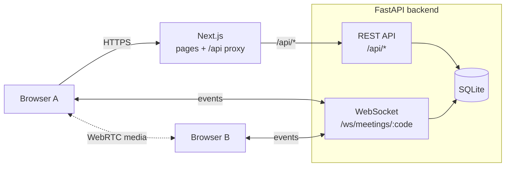
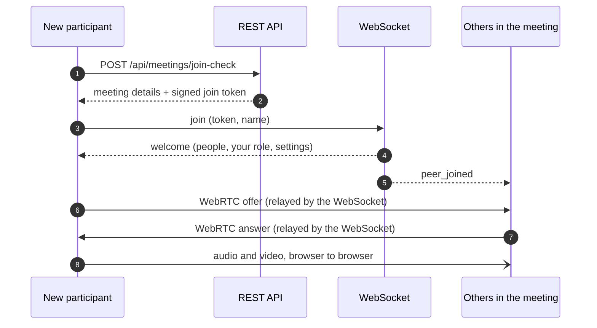
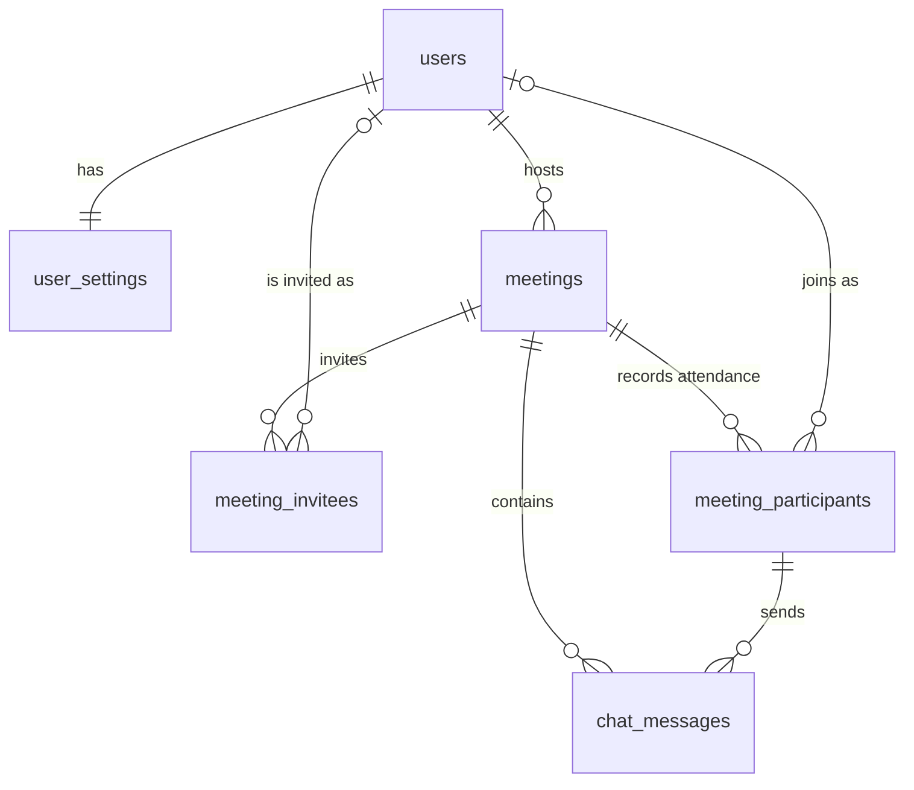

# Zoom Clone — Zoom Workplace web client

A working clone of the **Zoom Workplace web client**. Schedule and manage meetings, then meet with real
video, audio, screen sharing, chat and host controls, all in the browser.

**Live app:** https://zoom-gamma-lemon.vercel.app
**Demo login:** `kartikChopra@demo.dev` / `password123`

> **Try a call:** start a **New meeting**, copy the invite link from **ⓘ** next to the meeting title, and
> open it in an incognito window or on another device.

| Home | Meeting room |
|---|---|
|  |  |
| **Schedule Meeting** | **Host controls and waiting room** |
|  |  |

<sub>Screenshots come from the automated tests, which use a synthetic "Fake camera" because headless browsers have no webcam.</sub>

## Contents

1. [Features](#features)
2. [Tech stack](#tech-stack)
3. [Getting started](#getting-started)
4. [Architecture](#architecture)
5. [Database](#database)
6. [API reference](#api-reference)
7. [Project structure](#project-structure)
8. [Testing](#testing)
9. [Deployment](#deployment)
10. [Design decisions](#design-decisions)
11. [Assumptions and limitations](#assumptions-and-limitations)

---

## Features

### Assignment requirements

| Requirement | How it's built |
|---|---|
| **Landing dashboard** | Home (`/`): live clock, New meeting / Join / Schedule tiles, a day calendar, Upcoming and Recent meetings, profile and settings in the top bar |
| **Instant meeting** | **New meeting** creates an 11-digit ID, a passcode and an invite link `/j/<id>?pwd=<token>`, then opens the room `/wc/<id>`. The ▾ menu can use your Personal Meeting ID (PMI) instead |
| **Join by ID or link** | The **Join** dialog takes an ID or a pasted link plus your name. Invite links open `/j/<id>`, then the **Enter Meeting Info** page with a camera preview. Unknown IDs and wrong passcodes are rejected |
| **Schedule meetings** | Zoom's Schedule Meeting form: topic, description, date and time, duration, time zone, invitees, passcode, waiting room and video defaults. Saved meetings appear in Upcoming |

### Bonus features

| Feature | Details |
|---|---|
| **Responsive design** | Phone, tablet and desktop. On phones the left rail becomes a bottom tab bar, the meeting goes full screen and the toolbar collapses into **More** |
| **Login and sign-up** | Sign In, Sign Up and Sign Out. A browser with no session uses the seeded default user, as the brief asks |
| **Host controls** | Mute one or all (optionally blocking self-unmute), Ask to Unmute, remove a participant, co-hosts, hand over host, waiting room (with an "entered the waiting room" prompt), lock meeting, and permissions for sharing, chat, renaming and unmuting. **The server enforces every rule** |

### Beyond the brief

- **Live meetings:**
  - **Media:** peer-to-peer video and audio, and screen sharing (one person at a time).
  - **Views:** speaker view that follows the active speaker, gallery view, pinning.
  - **Chat and reactions:** group and direct chat with unread badges, emoji reactions, raise hand.
  - **Toolbar:** hides itself when the mouse is idle.
- **Meetings tab:** Upcoming and Previous lists, PMI card, Start, Copy Invitation, Edit and Delete.
- **Settings:** display name, and "mute my microphone" / "turn off my video" when joining.
- **Resilience:**
  - **Reconnects** automatically after a network drop.
  - **One connection per browser:** a second tab can take over.
  - **Refreshes keep your role:** a page refresh doesn't hand away host.
  - **Error pages:** proper 404 and error pages.

---

## Tech stack

| Layer | Technology |
|---|---|
| Frontend | Next.js 15 (App Router), TypeScript, Tailwind CSS v4, TanStack Query, Zustand |
| Backend | FastAPI, SQLAlchemy 2, Alembic, Pydantic v2 |
| Database | SQLite |
| Realtime | FastAPI WebSockets (signaling and meeting events) and WebRTC (media) |
| Auth | JWT in an httpOnly cookie, passwords hashed with bcrypt |
| Tests | pytest (backend), Playwright (end-to-end, several real browsers) |
| Hosting | Vercel (frontend), Railway (backend and database volume), Metered (TURN relay) |

---

## Getting started

### Prerequisites

- **Python 3.13** with [uv](https://docs.astral.sh/uv/)
- **Node.js 20+**

### Run locally

```bash
# Terminal 1 — backend on http://localhost:8000 (API docs at /docs)
cd backend
uv sync                          # install dependencies
uv run alembic upgrade head      # create zoom.db
uv run python -m app.seed        # sample users and meetings (add --reset to start over)
uv run uvicorn app.main:app --reload

# Terminal 2 — frontend on http://localhost:3000
cd frontend
npm install
npm run dev
```

Open http://localhost:3000. You're signed in as **Kartik Chopra**.

| Seeded account | Password |
|---|---|
| `kartikChopra@demo.dev` (default user) | `password123` |
| `priya@`, `rahul@`, `neha@`, `arjun@zoomclone.dev` | `password123` |

### Try a real meeting

1. Click **New meeting** and allow your camera.
2. Open **ⓘ** next to the meeting title and copy the invite link.
3. Open the link in an incognito window, another browser or another device, and choose **Join from browser**.

People on the same network connect directly. People on different networks may need a TURN server; see below.

### Configuration

**Backend** — environment variables or `backend/.env` (template: `backend/.env.example`)

| Variable | Default | Purpose |
|---|---|---|
| `DATABASE_URL` | `sqlite:///./zoom.db` | SQLAlchemy database URL |
| `FRONTEND_URL` | `http://localhost:3000` | Base URL for invite links |
| `CORS_ORIGINS` | `["http://localhost:3000"]` | Allowed browser origins |
| `JWT_SECRET` | development value | Signs session cookies and join tokens. **Use a long random value in production** |
| `COOKIE_SECURE` | `false` | `true` when served over HTTPS |
| `DEFAULT_USER_EMAIL` | `kartikchopra@demo.dev` | Account used when no one is signed in |
| `EMPTY_ROOM_GRACE_SECONDS` | `30` | How long an empty meeting waits before ending |
| `STUN_URLS`, `TURN_URLS`, `TURN_USERNAME`, `TURN_CREDENTIAL` | Google STUN, no TURN | ICE servers handed to browsers |

**Frontend**

| Variable | Default | Purpose |
|---|---|---|
| `BACKEND_URL` | `http://localhost:8000` | Where Next.js forwards `/api/*` |
| `NEXT_PUBLIC_WS_URL` | `ws://<host>:8000` | Base URL of the meeting WebSocket |

---

## Architecture

### Overview



The app talks over three channels:

| Channel | Carries | Path |
|---|---|---|
| **REST** | Accounts, meeting records, the join check | Browser → Next.js → FastAPI. The proxy keeps the session cookie on the frontend's own domain |
| **WebSocket** | WebRTC signaling, participant state, chat, reactions, host controls | Browser ↔ FastAPI directly, authenticated with a join token |
| **WebRTC** | Audio, video and screen share | Browser ↔ browser. **The server never relays media** |

### Joining a meeting



- **Who calls whom:** the newcomer calls each person already in the meeting, so two browsers never call each other at the same moment.
- **Fixed media slots:** every connection has three slots (audio, camera, screen). Turning a device on or off swaps the track in its slot (`replaceTrack`), so the connection is never renegotiated.
- **Who becomes host:** you're the host only if the token says you own the meeting *and* you entered through Start or New meeting. Opening your own invite link makes you an attendee.

### Meeting rules

| Situation | What happens |
|---|---|
| Meeting not started yet | Attendees see "Please wait for the host" until the host arrives |
| Waiting room on | New joiners wait until a host or co-host admits them |
| Meeting locked | New joiners are turned away |
| Same browser, second tab | "You're already in this meeting in another tab", with **Join here instead** |
| Page refresh | Reconnects and keeps your role |
| Host drops out | Host passes to someone else after 10 s, so a refresh doesn't give it away |
| Owner returns | Reclaims host; the temporary host becomes co-host |
| Everyone leaves | The meeting ends after 30 s |
| Backend restarts | Meetings still marked live are closed |

Live room state is kept **in memory** on the server. Attendance and chat are written to SQLite.

### Frontend organisation

- **Pages** read from stores and call `roomActions`; they never talk to the network directly.
- **`MeetingConnection`** connects the WebSocket and WebRTC layers to those stores.
- **Microphone and camera state** is read directly from the media tracks, so the toolbar and what others see can't disagree.

---

## Database

### Relationships



### Tables

| Table | One row is | Key columns |
|---|---|---|
| `users` | An account | `email` (unique), `password_hash` |
| `user_settings` | One user's joining defaults | `mute_mic_on_join`, `video_off_on_join` |
| `meetings` | An instant, scheduled or personal (PMI) meeting | `meeting_code`, `meeting_type`, `status`, `scheduled_start`, `invite_token` |
| `meeting_invitees` | An email invited to a meeting | `email`, `user_id` (filled in once that email has an account) |
| `meeting_participants` | One join of a meeting, by an account or a guest | `display_name`, `role`, `joined_at`, `left_at` |
| `chat_messages` | One chat message | `sender_id`, `recipient_id` (empty for messages to everyone) |

`meeting_participants` keeps **one row per join** so it can record history. That powers "Recent meetings" and
"N people joined", and covers guests who have no account.

<details>
<summary><b>All columns</b></summary>

**`users`** — `id`, `name`, `email`, `password_hash`, `avatar_color`, `timezone`

**`user_settings`** — `user_id` (PK and FK), `mute_mic_on_join`, `video_off_on_join`

**`meetings`**

| Column | Notes |
|---|---|
| `id` | Primary key |
| `meeting_code` | 11 digits, or 10 for a PMI. Empty when the meeting borrows the host's PMI |
| `host_id` | → `users` |
| `title`, `description` | |
| `meeting_type` | `instant`, `scheduled` or `personal` |
| `status` | `not_started`, `live` or `ended` |
| `use_pmi` | Meeting runs in the host's personal room |
| `scheduled_start`, `duration_minutes`, `timezone` | Start time stored in UTC |
| `passcode`, `invite_token` | `invite_token` is unique; it's the `pwd` in invite links |
| `waiting_room`, `mute_on_entry`, `host_video`, `participant_video` | Meeting options |
| `started_at`, `ended_at` | |

**`meeting_invitees`** — `id`, `meeting_id`, `email`, `user_id` (nullable)

**`meeting_participants`** — `id`, `meeting_id`, `user_id` (nullable for guests), `display_name`, `role` (`host`, `co_host` or `attendee`), `joined_at`, `left_at`, `was_removed`

**`chat_messages`** — `id`, `meeting_id`, `sender_id`, `recipient_id` (nullable), `body`, `sent_at`

</details>

### Integrity rules

These are enforced by the database itself, not just the app:

| Rule | How |
|---|---|
| One personal room per user | Partial unique index on `host_id` where `meeting_type = 'personal'` |
| A meeting has its own code *or* borrows the PMI | `CHECK` tying `use_pmi`, `meeting_code` and `invite_token` together |
| Scheduled meetings have a start time and duration | `CHECK` |
| Only valid types, statuses and roles | Stored as text with `CHECK` constraints |
| An email is invited once per meeting | Unique `(meeting_id, email)` |
| Deleting a meeting removes its invitees, attendance and chat | `ON DELETE CASCADE` |
| Deleting a user keeps meeting history | Their invitee and attendance rows are set to `NULL` |

- **Indexes:** `(host_id, scheduled_start)` for the Upcoming list, `(meeting_id, left_at)` for who is still present, `(meeting_id, sent_at)` for chat order.
- **Times:** stored in UTC. A custom column type restores the UTC time zone when reading from SQLite.
- **Migrations:** `backend/alembic/versions/`.

---

## API reference

Interactive docs at http://localhost:8000/docs. Errors always have the shape
`{"error": {"code": "...", "message": "..."}}`.

### REST

| Method | Path | Purpose |
|---|---|---|
| `POST` | `/api/auth/signup`, `/login`, `/logout`, `/guest` | Sessions (httpOnly cookie) |
| `GET` `PATCH` | `/api/users/me` | Profile, settings and PMI |
| `PATCH` | `/api/users/me/settings` | Joining defaults |
| `GET` | `/api/meetings?scope=upcoming\|previous` | Meeting lists |
| `GET` | `/api/meetings/calendar?start=&end=` | Home day view |
| `POST` | `/api/meetings/instant` | New meeting |
| `POST` | `/api/meetings` | Schedule a meeting |
| `POST` | `/api/meetings/join-check` | Validate ID, link or passcode and return a join token (works for guests) |
| `GET` `PATCH` `DELETE` | `/api/meetings/{id}` | Details, edit, delete |
| `GET` | `/api/meetings/{id}/invitation` | Invitation text |
| `POST` | `/api/meetings/{id}/start`, `/end` | Start, End Meeting for All |
| `GET` | `/api/rtc/config` | STUN/TURN servers |

### WebSocket — `/ws/meetings/{code}`

Every client message is validated with Pydantic (`backend/app/ws/protocol.py`).

| Sent by | Messages |
|---|---|
| Any participant | `join`, `signal`, `state`, `chat`, `reaction`, `rename`, `leave` |
| Hosts and co-hosts | `mute`, `mute_all`, `ask_unmute`, `remove`, `set_role`, `settings`, `admit`, `deny`, `end` (host only) |
| Server | `welcome`, `waiting_for_host`, `waiting_room`, `waiting_list`, `peer_joined`, `peer_left`, `peer_updated`, `settings_updated`, `signal`, `chat`, `reaction`, `force_mute`, `unmute_request`, `removed`, `replaced`, `meeting_ended`, `error` |

---

## Project structure

```
.
├── backend/
│   ├── app/
│   │   ├── core/        config, database, auth dependencies, JWT and bcrypt, error format
│   │   ├── models/      SQLAlchemy models
│   │   ├── schemas/     Pydantic request and response models
│   │   ├── services/    business logic: meetings, auth, live-meeting persistence, IDs and links
│   │   ├── routers/     REST endpoints (thin)
│   │   ├── ws/          WebSocket protocol, in-memory room manager, endpoint
│   │   └── seed.py      sample data
│   ├── alembic/         migrations
│   └── tests/           pytest suite
├── frontend/src/
│   ├── app/             routes: (workplace) signed-in shell, (public) invite and auth pages
│   ├── components/      shell, home, meetings, join, room, auth, ui
│   └── lib/             API client, queries, formatting, join sessions
│       └── meeting/     devices, room store, actions, WebSocket connection, WebRTC peers
├── e2e/                 Playwright tests
└── docs/screenshots/    images used in this README
```

---

## Testing

```bash
# Backend — 63 tests: REST, auth, WebSocket rooms, host controls
cd backend
uv run pytest
uv run ruff check .

# End-to-end — 21 tests in real browsers (starts both servers and reseeds the local database)
cd e2e
npm install && npx playwright install chromium
npx playwright test
```

The end-to-end tests put several real browsers in the same meeting and check that **WebRTC video frames arrive
in both directions**. They cover every host control, the auth flows, settings and the phone layout. Headless
browsers have no webcam, so a test script supplies a synthetic camera (an animated canvas) and microphone (a
tone generator); the app code runs unchanged.

To run them against a deployment instead, set `BASE_URL` (no reseeding happens). Note that this leaves test
meetings in that deployment's database:

```bash
BASE_URL=https://zoom-gamma-lemon.vercel.app npx playwright test room networking
```

---

## Deployment

| Part | Host | Settings |
|---|---|---|
| Frontend | **Vercel**, root directory `frontend` | `BACKEND_URL=https://<backend>`, `NEXT_PUBLIC_WS_URL=wss://<backend>` |
| Backend | **Railway**, root directory `backend` (`Dockerfile`, `railway.json`) | Volume at `/data`, `DATABASE_URL=sqlite:////data/zoom.db`, `JWT_SECRET`, `COOKIE_SECURE=true`, `FRONTEND_URL` and `CORS_ORIGINS` set to the Vercel URL |
| TURN relay | **Metered** | `TURN_URLS`, `TURN_USERNAME`, `TURN_CREDENTIAL` on the backend |

- **Backend startup:** `backend/start.sh` runs migrations, seeds the database only if it's empty, then starts uvicorn on `$PORT`.
- **Cookies:** Vercel forwards `/api/*` to the backend, so the login cookie belongs to the frontend's domain.
- **WebSocket:** connects straight to the backend and authenticates with the join token, so it needs no cookie.

---

## Design decisions

- **Peer-to-peer WebRTC, not a media server or paid SDK.** No external accounts or costs, and the whole real-time stack lives in this repo. The trade-off is that each person uploads one stream per other person, which suits meetings of about 6. A media server (SFU) such as LiveKit could replace it without changing the signaling layer.
- **The server decides, the UI follows.** Host controls, permissions, screen-share conflicts, the waiting room and locking are all checked on the server. A modified client can't unmute itself when the host has disabled it.
- **Join tokens.** The WebSocket trusts a short-lived signed token from the join check instead of re-checking passcodes. Guests need no account.
- **In-memory live state.** One backend process holds the live rooms, which suits SQLite and a single instance. Running several instances would mean moving this state to Redis.
- **Default user alongside real auth.** A browser with no session uses the default user, as the brief requires. Signing out turns this off, so Sign In, Sign Up and switching accounts work normally. Meeting links opened in a fresh browser always join as a guest.
- **Zoom fidelity.** Colours were sampled from screenshots of the current Zoom Workplace web client, and the layouts, copy and flows follow it.

---

## Assumptions and limitations

**Assumptions**

- **Placeholders:** Recordings, Summaries, Notes, Team Chat, Contacts and calendar sync are shown but are outside the assignment.
- **Recurring meetings** aren't supported; the checkbox is shown disabled.
- **Removing a participant** blocks that browser and that account from rejoining the same meeting. The owner's account is never blocked.
- **Time zones:** times are stored in UTC and shown in the browser's time zone. The schedule form uses the time zone you pick.

**Known limitations**

- **About 6 people per meeting**, because media is peer-to-peer.
- **Restarting the backend ends live meetings**, because room state is in memory.
- **Different networks may need a TURN server** to connect.
- **No email delivery.** Invitees see the meeting in Upcoming once they have an account, but no email is sent.
